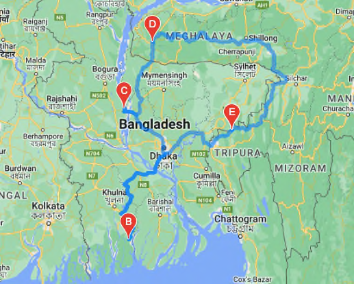
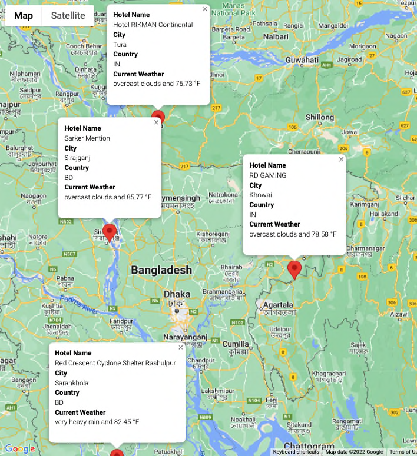

# Plan My Trip (BETA feature)

The notebooks in this project will allow users to create a travel map and itinerary anywhere around the world. This is a prototype of the final system that will allow users to seemlessly create a travel map and itinerary. As a demo system, the user will need to use 3 different notebooks.

## Notebooks Used for Demo Purposes

### Weather_Database.ipynb:
This notebook will create a database of random cities around the globe.

### Vacation_Search.ipynb:
This notebook will use the database created by the Weather_Database notebook to present the user with a map of the globe with markers for each city that is currently in the temperature range chosen by the user.

### Vacation_Itinerary.ipynb:
This notebook presents the same map and markers for the user to make a final travel route and intinerary of hotels along the way.

## Creating a Travel Route and Itinerary
This section will walk the user through the steps of using the noteboooks provided to create a final vacation destination map and itinerary of hotels.

### Step 1:
The intial set up requires the user to create a database of random cities around the globe. To create the database the user would run the Weather_Database notebook. This will create a list of cities to be used subsequently by the Vacation_Search notebook.

Once the random cities are generated, they will not need to be generated again unless the user would like to try again with a new set of data.

### Step 2:
Next the user will run the Vacation_Search notebook to enter a temperature range for choosing cities that are currently in the range of temps that the user would like for their vacation.  Once the temps are put into the notebook, the user will continue to run it to get to the map markers for all of the cities within the given temperature range. This map can be used to get a general idea of where the user may like to go for vacation and will look similar to the image below:

### Step 3:
After the user has an idea of where they would like to go, they will run the Vacation_Intinerary notebook where they will be presented once again with the map showing the markers for all of the cities available in the temp range chosen earlier.  

Here, they will pick a few cities for their final travel destinations and itinerary. Follow these steps to create the destination map:

- Chose a few cities within a reasonable driving distance in the desired country to visit.  
- Plug the names of the cities into the cell and run it to set the starting and end points and any points in between.
- Run the next cell to get the latitude and longitude for each city to be used in the next cell to create the map.
- Running the next cell will display a map similar to the one below. For this demo, we chose a few cities in India and Bangledesh to make for a very interesting trip!

Finally, the user will generate a map with markers for each desitnation along the route to see which hotels are close to the city chosen by the user earlier. To generate the itinerary map follow these steps:

- Run the next cell to combine the cities that will be included in the itinerary.
- Next, run the cell that formats the hotel info to be included on the marker for each city.
- Finally, run the next cell to put the final intinerary together on one map. To see the full itinerary, select each marker to look similar to the map below for our demo: 

It looks like we need to be prepared for some rain. We will also be traveling along some new terrain so be sure to look up more information about each of the cities before heading out. 

Pack your bags and get ready for the trip of your lifetime!
